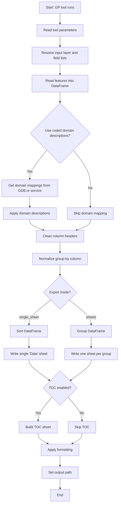

# ArcGIS-Pro-Custom-Geoprocessing-Grouping-Excel-Export
A custom geoprocessing tool for ArcGIS Pro that has options for grouping data when exported to an Excel document.

super_excel_export/
├─ tool_entry.py           # ArcGIS Pro script tool entry point
├─ super_export/
│  ├─ __init__.py          # Package initializer
│  ├─ core.py              # run_export() and overall workflow
│  ├─ data_utils.py        # Layer reading, fields, domains, DataFrame ops
│  └─ excel_utils.py       # Sheet naming, TOC, formatting, Excel writing

This project contains a multi-file Python implementation of an advanced ArcGIS Pro geoprocessing tool for exporting feature layer data to Excel.  

The tool supports:

- Exporting all fields or a custom field list
- Optional domain code → description** mapping
- Optional field alias output
- Single-sheet or multi-sheet grouped Excel export
- Automatic column width adjustment
- Freeze header row option
- TOC (Table of Contents) sheet creation
- Full compatibility with ArcGIS Pro script tools

