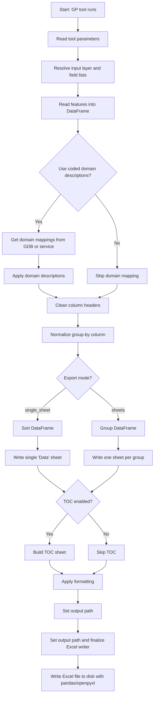

# ArcGIS-Pro-Custom-Geoprocessing-Grouping-Excel-Export
A custom geoprocessing tool for ArcGIS Pro that has options for grouping data when exported to an Excel document.

This repository contains:

- Geoprocessing Tool Grouping Excel Export.atbx — the ArcGIS Pro toolbox, with Python embedded
- Grouping Excel Export Tool Sample Data.gdb.zip — optional file geodatabase for testing
      --! NOTE: Windows seems to error when unzipping the .zip file containing this sample data .gdb.
      --! YOU MUST cut and paste it somewhere outside the downloaded repository file and then unzip it for it to work.
- Grouping_Excel_Output.xlsx - example file - output result from this tool

The tool supports:

- Exporting all fields or a custom field list
- Optional domain code → description** mapping
- Optional field alias output
- Single-sheet or multi-sheet grouped Excel export
- Automatic column width adjustment
- Freeze header row option
- TOC (Table of Contents) sheet creation
- Full compatibility with ArcGIS Pro script tools

```mermaid
flowchart TD

    A["Start: GP tool runs"] --> B["Read tool parameters"]
    B --> C["Resolve input layer and field lists"]
    C --> D["Read features into DataFrame"]

    D --> E{"Use coded domain descriptions?"}

    E -->|Yes| F["Get domain mappings from GDB or service"]
    F --> G["Apply domain descriptions"]
    E -->|No| H["Skip domain mapping"]

    G --> I["Clean column headers"]
    H --> I["Clean column headers"]

    I --> J["Normalize group-by column"]

    J --> K{"Export mode?"}

    K -->|single_sheet| L["Sort DataFrame"]
    L --> M["Write single 'Data' sheet"]

    K -->|sheets| N["Group DataFrame"]
    N --> O["Write one sheet per group"]

    M --> P{"TOC enabled?"}
    O --> P{"TOC enabled?"}

    P -->|Yes| Q["Build TOC sheet"]
    P -->|No| R["Skip TOC"]

    Q --> S["Apply formatting"]
    R --> S["Apply formatting"]

    S --> T["Set output path"]
    T --> U["Set output path and finalize Excel writer"]
    U --> V["Write Excel file to disk with pandas/openpyxl"]
```

## Version History
### v1.4
Field alias resolution now mirrors ArcGIS Pro’s native Excel export behavior. The tool prefers layer‑level CIM aliases when present, falls back to geodatabase aliases when the layer has not persisted field settings yet, and uses raw field names only when no alias exists. This prevents “silent” alias loss for untouched layers added directly from a .gdb.
Added small robustness fixes: selection detection now tolerates layers without FIDSet, and Table of Contents hyperlink targets safely handle sheet names containing apostrophes.

### v1.3
- Fixed an issue where the **Domain Descriptions instead of Codes** option only worked for text-based domain fields.  
  Numeric coded-value domains are now handled correctly.
- Updated schema detection to use the **map feature layer** rather than the underlying geodatabase feature class, ensuring exported Excel files respect field order and field aliases.
- Improved formatting and clarity of ArcGIS Pro tool messages shown during execution.

### v1.0
- Initial public release

Keywords:
ArcGIS Pro

arcpy

Excel export

geoprocessing tool

field aliases

domain descriptions

grouping data
