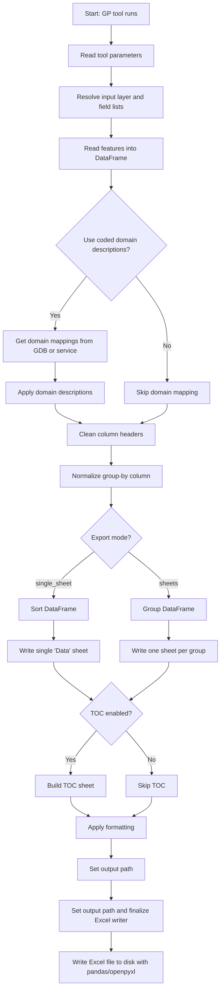

# ArcGIS Pro Grouped Excel Export

**A custom ArcGIS Pro geoprocessing tool (arcpy + pandas + openpyxl) that exports feature layer attribute tables to grouped, multi-sheet Excel workbooks — preserving field aliases and coded domain descriptions.**

[](LICENSE)
[](https://www.esri.com/en-us/arcgis/products/arcgis-pro/overview)
[](src/grouped_excel_export.py)
[](../../releases)

ArcGIS Pro's built-in **Table To Excel** tool produces a single flat table. This tool adds what that one is missing: **group-by export into one worksheet per value**, a hyperlinked table of contents, alias-aware column headers, and coded value domain description mapping.

> **Looking for the code?** The runnable artifact is the `.atbx` toolbox, but the full Python source is mirrored in readable form under [`src/`](src/) — see [`src/grouped_excel_export.py`](src/grouped_excel_export.py) (~1,670 lines).

---

## Contents

| File | Purpose |
| --- | --- |
| `Geoprocessing Tool Grouping Excel Export.atbx` | **The tool.** ArcGIS Pro toolbox with embedded Python. This is all you need to run it. |
| [`src/grouped_excel_export.py`](src/grouped_excel_export.py) | Readable mirror of the execute script (reference only). |
| [`src/tool_validator.py`](src/tool_validator.py) | Readable mirror of the `ToolValidator` class controlling parameter behavior. |
| [`tools/extract_atbx_scripts.py`](tools/extract_atbx_scripts.py) | Regenerates the `src/` mirror from the `.atbx`. |
| `Grouping Excel Export Tool Sample Data.zip` | Optional file geodatabase for testing. |
| `Grouping_Excel_Output.xlsx` | Example output produced by the tool. |

---

## Installation

No installation or Python configuration required. The tool ships as an ArcGIS Pro toolbox (`.atbx`) with embedded Python and runs in the default ArcGIS Pro Python environment.

1. Download this repository as a `.zip` (or grab just the `.atbx` from [Releases](../../releases)).
2. Unzip to a local folder.
3. In **ArcGIS Pro**, open your project (`.aprx`).
4. In the **Catalog** pane, right-click **Toolboxes** → **Add Toolbox** → select `Geoprocessing Tool Grouping Excel Export.atbx`.

The tool appears in your project and runs like any other geoprocessing tool.

> **Note on the sample data:** Windows may error when unzipping the `.gdb` *inside* the downloaded repository folder. Extract it to a location outside that folder before use.

**Requirements:** ArcGIS Pro 3.x with `arcpy`, `pandas`, and `openpyxl` (all present in the default Pro conda environment). The tool fails fast with a clear message if run in a custom environment missing these.

---

## Why this tool exists

ArcGIS Pro's built-in **Export To Excel** produces flat tables. That works well until your data contains **one-to-many relationships** and you need output grouped in a meaningful way.

This tool is designed for cases where rows naturally belong to a parent:

- Meters grouped by transformer
- Trees grouped by management area
- Water samples grouped by building or room
- Assets grouped by project, site, or inspection batch

Instead of manually sorting and splitting Excel files after export, this tool generates **clean, structured Excel workbooks automatically**.

### Especially useful if

- Your data has a logical parent-child relationship
- You frequently reorganize Excel exports after the fact
- Field aliases and domain descriptions matter in your reports
- You want structured Excel output with minimal post-processing
- You share GIS data with non-GIS staff who live in Excel

---

## Conceptual example

**Input: ArcGIS attribute table (group field highlighted)**


⬇️ **Export grouped by field**

**Output: Excel workbook** — one worksheet per group value, plus an optional Table of Contents sheet.


### Real-world use case

In an electric utility GIS, meters are connected to transformers. When exporting meter data for reporting or review, it is often necessary to group meters by transformer.

| Without this tool | With this tool |
| --- | --- |
| Export a flat table | Choose transformer ID as the group field |
| Sort and filter manually | Run the tool |
| Copy rows into separate sheets | One worksheet per transformer, automatically |
| Repeat for each transformer | Aliases and domain descriptions preserved |

---

## Capabilities

- Export all fields or a custom field list
- Optional coded value domain code → description mapping (file/enterprise geodatabase **and** feature services)
- Optional field alias column headers, matching ArcGIS Pro's native export behavior
- Single-sheet or multi-sheet grouped export
- Automatic column width fitting
- Freeze header row
- Table of Contents sheet with hyperlinks to each group sheet
- Excel-safe worksheet naming (illegal character sanitizing, 31-character limit, de-duplication)


### Tool parameters

| # | Parameter | Type | Description |
| --- | --- | --- | --- |
| 0 | Input Feature Layer | Feature Layer | The map layer to export attributes from. Honors an active selection. |
| 1 | Export all fields from Layer | Boolean | On = export every field. Off = enable the field picker below. |
| 2 | Fields to Export | Multi-value Field | Custom field subset. Disabled when "Export all fields" is checked. |
| 3 | Group By Field | Field | Rows sharing a value in this field are grouped together. |
| 4 | Include group-by field as an output column | Boolean | Include the group field in output even if not selected above. |
| 5 | Export domain descriptions instead of codes | Boolean | Map coded value domains to their descriptions. |
| 6 | Use field aliases as column headers | Boolean | Use layer/GDB aliases instead of raw field names. |
| 7 | Output Excel File | File (`.xlsx`) | Destination path for the workbook. |
| 8 | Export Mode | String | `sheets` = one worksheet per group. `single_sheet` = grouped and sorted in one sheet. |
| 9 | Add Table of Contents Sheet | Boolean | Adds a hyperlinked TOC. Hidden automatically in `single_sheet` mode. |
| 10 | Auto-Fit column widths | Boolean | Size columns to their contents. |
| 11 | Freeze the top row | Boolean | Freeze the header row in each sheet. |

---

## Internal processing overview


```mermaid
flowchart TD

    A["Start: GP tool runs"] --> B["Read tool parameters"]
    B --> C["Resolve input layer and field lists"]
    C --> D["Read features into DataFrame"]

    D --> E{"Use coded domain descriptions?"}

    E -->|Yes| F["Get domain mappings from GDB or service"]
    F --> G["Apply domain descriptions"]
    E -->|No| H["Skip domain mapping"]

    G --> I["Clean column headers"]
    H --> I["Clean column headers"]

    I --> J["Normalize group-by column"]

    J --> K{"Export mode?"}

    K -->|single_sheet| L["Sort DataFrame"]
    L --> M["Write single 'Data' sheet"]

    K -->|sheets| N["Group DataFrame"]
    N --> O["Write one sheet per group"]

    M --> P{"TOC enabled?"}
    O --> P{"TOC enabled?"}

    P -->|Yes| Q["Build TOC sheet"]
    P -->|No| R["Skip TOC"]

    Q --> S["Apply formatting"]
    R --> S["Apply formatting"]

    S --> T["Set output path"]
    T --> U["Set output path and finalize Excel writer"]
    U --> V["Write Excel file to disk with pandas/openpyxl"]
```

---

## Working with the source

The `.atbx` is the authoritative artifact — it is what runs in ArcGIS Pro. Because a `.atbx` is a ZIP container, the Python inside it is invisible to GitHub's code viewer, diff, and search. The files in [`src/`](src/) are a plain-text mirror published so the logic can be read and reviewed.

To modify the tool: edit the script inside the toolbox in ArcGIS Pro, then refresh the mirror:

```bash
python tools/extract_atbx_scripts.py
```

To verify the mirror matches the toolbox without writing files (exits non-zero if stale):

```bash
python tools/extract_atbx_scripts.py --check
```

The extractor uses only the Python standard library and does **not** require arcpy, so it runs anywhere.

---

## Version history

### v1.4
Field alias resolution now mirrors ArcGIS Pro's native Excel export behavior. The tool prefers layer-level CIM aliases when present, falls back to geodatabase aliases when the layer has not persisted field settings yet, and uses raw field names only when no alias exists. This prevents silent alias loss for untouched layers added directly from a `.gdb`.

Robustness fixes: selection detection now tolerates layers without `FIDSet`, and Table of Contents hyperlink targets safely handle sheet names containing apostrophes.

### v1.3
- Fixed an issue where **Domain Descriptions instead of Codes** only worked for text-based domain fields. Numeric coded value domains are now handled correctly.
- Schema detection now uses the **map feature layer** rather than the underlying geodatabase feature class, ensuring exports respect field order and field aliases.
- Improved formatting and clarity of the tool messages shown in the Geoprocessing pane.

### v1.0
- Initial public release

---

## License

[MIT](LICENSE) — free to use, modify, and redistribute.

---

<sub>**Keywords:** ArcGIS Pro · arcpy · Python toolbox · geoprocessing tool · script tool · export to Excel · table to Excel · xlsx export · multi-sheet Excel · group by field · field aliases · coded value domains · domain descriptions · pandas · openpyxl · Esri · GIS · electric utility · water utility · utility network · attribute table export · GIS reporting</sub>
