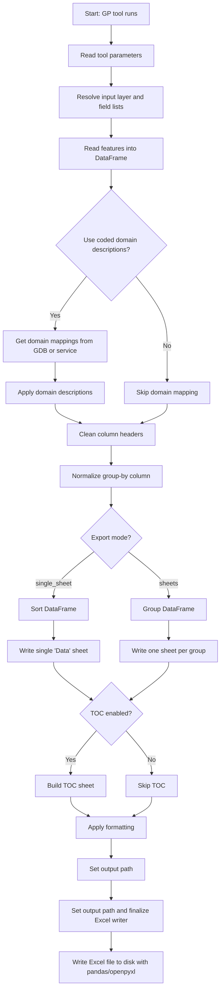

# ArcGIS-Pro-Custom-Geoprocessing-Grouping-Excel-Export
A custom geoprocessing tool for ArcGIS Pro that has options for grouping data when exported to an Excel document.

This repository contains:

- Geoprocessing Tool Grouping Excel Export.atbx — the ArcGIS Pro toolbox, with Python embedded
- Grouping Excel Export Tool Sample Data.zip — optional file geodatabase for testing
- Grouping_Excel_Output.xlsx - example file - output result from this tool

The tool supports:

- Exporting all fields or a custom field list
- Optional domain code → description** mapping
- Optional field alias output
- Single-sheet or multi-sheet grouped Excel export
- Automatic column width adjustment
- Freeze header row option
- TOC (Table of Contents) sheet creation
- Full compatibility with ArcGIS Pro script tools

Keywords:
ArcGIS Pro

arcpy

Excel export

geoprocessing tool

field aliases

domain descriptions

grouping data
